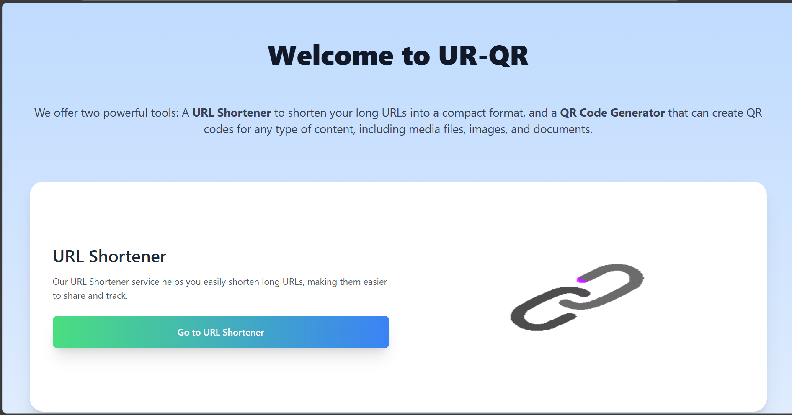
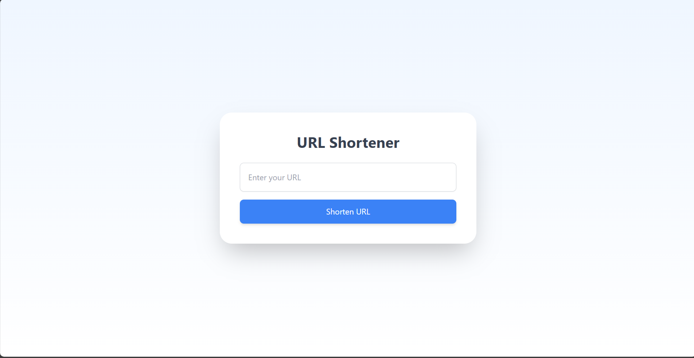
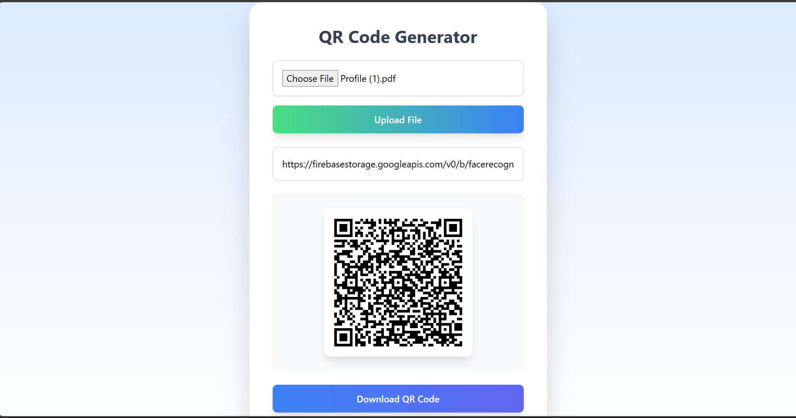

# **URL Shortener & QR Code Generator**

A powerful and elegant React-based web application offering two key utilities:

1. **URL Shortener**: Easily shorten long URLs for easy sharing and tracking.
2. **QR Code Generator**: Create QR codes for any content, including links, media files, and documents.

---

## **Features**

### 🌟 **URL Shortener**
- Convert lengthy URLs into compact, shareable links.
- Simplified sharing for emails, social media, and messages.
- Optimized for easy use and maximum compatibility.

### 🌟 **QR Code Generator**
- Generate QR codes for:
  - URLs
  - Text
  - Files and Media
- Beautiful, high-quality QR codes that can be shared and scanned effortlessly.

### 🌟 **Responsive Design**
- Fully responsive layout that looks great on all devices.
- Vibrant and spacious UI for a professional look.

---

## **Demo**

)  
*Screenshot of the application showcasing its features.*

---

## **Getting Started**

### **Prerequisites**
- Node.js (v14 or higher)
- npm or yarn installed on your system.

### **Installation**
1. Clone the repository:
   ```bash
   git clone https://github.com/raviburaga/url-qr-tool.git
   ```
2. Navigate to the project directory:
   ```bash
   cd url-qr-tool
   ```
3. Install dependencies:
   ```bash
   npm install
   ```
4. Start the development server:
   ```bash
   npm start
   ```
5. Open your browser and navigate to:
   ```
   http://localhost:3000
   ```

---

## **Project Structure**

```
url-qr-tool/
├── src/
│   ├── components/       # Reusable React components
│   ├── pages/            # Page-level components (Home, URL Shortener, QR Generator)
│   ├── assets/           # Static assets (images, GIFs, etc.)
│   ├── App.js            # Main application entry point
│   ├── index.js          # ReactDOM rendering
│   └── styles/           # Tailwind CSS configuration and global styles
├── public/               # Public assets
├── package.json          # Project dependencies and scripts
└── README.md             # Project documentation
```

---

## **Technologies Used**

- **React.js**: Frontend framework for building the UI.
- **React Router**: For page navigation.
- **Tailwind CSS**: For styling the application with modern utility-first CSS.
- **GIFs and Media**: Enhance the user experience with animations.

---

## **How to Use**

1. **Homepage**  
   Explore the available tools (URL Shortener & QR Code Generator).  
   

2. **URL Shortener**  
   Enter your long URL, and click the "Shorten URL" button to generate a compact URL.  
   

3. **QR Code Generator**  
   Add the content (URL, text, or file) and instantly generate a QR code for it.  
   

---

## **Contributing**

Contributions are welcome! Follow these steps to contribute:
1. Fork the repository.
2. Create a new branch:
   ```bash
   git checkout -b feature/your-feature
   ```
3. Commit your changes:
   ```bash
   git commit -m "Add your message"
   ```
4. Push your branch:
   ```bash
   git push origin feature/your-feature
   ```
5. Open a Pull Request.

---

## **License**

This project is licensed under the [MIT License](LICENSE).

---

## **Contact**

- **Author**: [Ravi Buraga](https://github.com/raviburaga)
- **Email**: buragaravi2002@gmail.com

Feel free to reach out with any feedback or questions!
